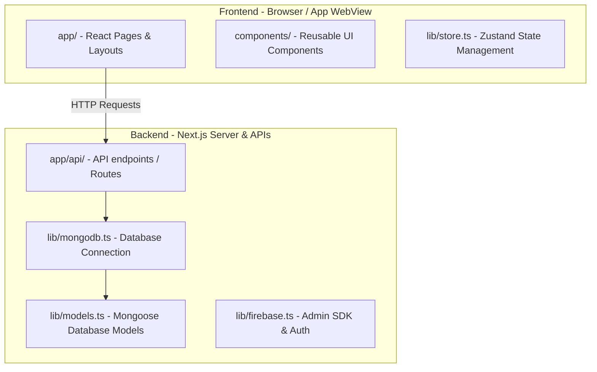

# Edibio Billing Application — Codebase Architecture

This document explains how the code is structured and separated between the **Frontend (User Interface)** and the **Backend (Server & Database)** layers, and how they build into different application platforms.

---

## 🗺️ Codebase Map: Frontend vs. Backend

The application is structured using **Next.js (App Router)**, which hosts both the frontend user experience and the backend server logic in a unified project.



---

## 🎨 1. The Frontend (Client-Side)
The frontend consists of React components, styling, and state stores that render in the user's browser, mobile WebView, or desktop shell.

| Directory / File | Description | Role / Tech |
| :--- | :--- | :--- |
| **`app/`** (excluding `api/`) | Page routing and layout structures. | React Server/Client Components |
| **`components/`** | Visual elements (buttons, forms, sidebar, graphs, receipts). | React UI Components |
| **`public/`** | Static assets, logo images, sounds, fonts. | Asset hosting |
| **`types/`** | TypeScript interfaces definitions. | Type Safety |
| **`lib/store.ts`** | Client state management (invoice state, current company details, cart items). | Zustand |
| **`lib/utils.ts`** | Client side styling utilities (`cn`), format functions, math helpers. | JavaScript Helpers |

---

## 🖥️ 2. The Backend (Server-Side)
The backend manages data persistence, security validations, database connections, and third-party integrations (payments, SMS).

| Directory / File | Description | Role / Tech |
| :--- | :--- | :--- |
| **`app/api/`** | API routes responding to frontend requests (e.g., `/api/sync`, `/api/payments`, `/api/auth`). | Next.js Serverless Functions |
| **`lib/mongodb.ts`** | Established connection pooler to MongoDB Atlas cluster. | Mongoose / MongoDB |
| **`lib/models.ts`** | Defines MongoDB collection schemas (User, Company, Invoice, Party, Product, Expense). | Mongoose Schemas |
| **`lib/firebase.ts`** | Auth state validation, user registration verification. | Firebase Admin SDK |
| **`lib/subscription.ts`** | Subscription validation and expiry checking utilities. | Server Logic |
| **`lib/invoiceNumber.ts`**| Auto-generation logic for consecutive invoice prefixes/counters. | Server Utility |

---

## 🚀 3. Multi-Platform Build Configurations

The exact same codebase compiles into three different client applications. Here is how it behaves on each:

### A. Web App (Cloud Deployment)
- Runs as a standard Next.js application.
- API endpoints under `app/api/` are executed on the server side (e.g., Vercel serverless functions).
- **Run command**: `npm run dev`
- **Build command**: `npm run build` (outputs serverless build)

### B. Mobile App (Capacitor Android Build)
- Runs client-only (SPA mode) inside an Android WebView container.
- Because mobile devices have no local Node.js server, **Next.js server features and APIs are disabled**; it calls remote APIs.
- We compile the Next.js frontend into a static export folder (`out/`) which is bundled into the Android application package (APK).
- **Configuration file**: [capacitor.config.ts](file:///d:/edibio/edibio-app/capacitor.config.ts) (`webDir: 'out'`)
- **Compilation command**:
  ```bash
  $env:NEXT_PUBLIC_APK_BUILD="true"
  npm run build
  npx cap sync
  ```
  *(This compiles files to `/out` and copies them to the native `/android` project directory).*

### C. Desktop App (Electron Build)
- Runs client-only inside an Electron Chromium window on Windows/macOS.
- Like Mobile, the static build is packed into the Electron container.
- **Entry Point**: [main.js](file:///d:/edibio/edibio-app/main.js)
- **Source code for Desktop wrappers**: `electron-src/`
- **Build command**: `npm run electron:build` (uses `electron-builder` to generate a Windows `.exe` installer under `release/` directory).

---

## 🛠️ 4. Maintenance & Developer Scripts
All developer maintenance utilities are isolated under:
- **[scripts/](file:///d:/edibio/edibio-app/scripts/)**: Contains standalone TS/JS tools for manual operations (e.g. testing keys, verifying DB status, batch-wiping mock company accounts). These are not run by the application runtime.
